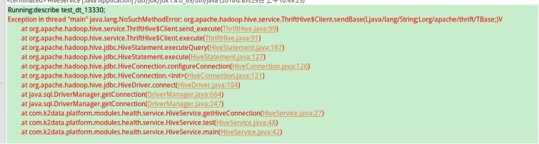
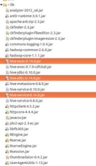
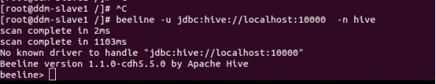

1 Org.apache.hadoop.hive.service.ThriftHive

1 找不到org.apache.hive.jdbc.HiveDriver  （升级到hive-jdbc-0.14.0.jar） 
2 org.apache.hive.service.cli.thrift.TCLIService（升级到hive-service-0.14.0.jar） 
3 org.apache.thrift.TServiceClient（升级到hive-exec-0.14.0.jar） 
以上问题基本由于版本导致（升级后如图）：

2 beeline -u jdbc:hive://localhost:10000 -n hive 
报错：no known driver to handle "jdbc:hive://localhost:10000" 

解决办法1： 
beeline -u jdbc:hive2://localhost:10000 -n hive 
解决办法2： 
beeline -u jdbc:hive2://localhost:10000 -d org.apache.hive.jdbc.HiveDriver 
 -n hive 
