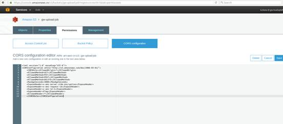

AWS S3 javascript上传文件
1 To upload the file successfully, you need to enable CORS configuration on S3.

Generally, it is not advisable to display your keys directly on page, so you can use Amazon Cognito or web identity federation feature. 


To know more use the below given link : http://docs.aws.amazon.com/AWSJavaScriptSDK/guide/browser-configuring.html
http://docs.aws.amazon.com/AWSJavaScriptSDK/latest/AWS/S3.html

2 Set Aws Bunket CORS like this:
``` javascript
<?xml version="1.0" encoding="UTF-8"?>
 <CORSConfiguration xmlns="http://s3.amazonaws.com/doc/2006-03-01/">
	<CORSRule><AllowedOrigin>*</AllowedOrigin>
	<AllowedMethod>GET</AllowedMethod>
	<AllowedMethod>PUT</AllowedMethod>
	<AllowedMethod>POST</AllowedMethod>
	<AllowedMethod>DELETE</AllowedMethod>
	<MaxAgeSeconds>3000</MaxAgeSeconds>
	<ExposeHeader>x-amz-server-side-encryption</ExposeHeader>
	<ExposeHeader>x-amz-request-id</ExposeHeader>
	<ExposeHeader>x-amz-id-2</ExposeHeader>
	<ExposeHeader>ETag</ExposeHeader>
	<AllowedHeader>*</AllowedHeader>
	</CORSRule></CORSConfiguration>
```
 


3  Set the Aws Config in jsp like this:

   ``` javascript
		AWS.config.update({
			region: 'cn-north-1'
		});
		AWS.config.apiVersions = {
			s3: '2006-03-01'
		}; 
			var accessKeyId = "xx";
			var secretAccessKey = xx";
			var token = "xx";//如果不是生成的临时token,可以不要
			var creds = new AWS.Credentials({
				accessKeyId: accessKeyId,
				secretAccessKey: secretAccessKey,
				sessionToken: token //如果不是生成的临时token,可以不要
			});
			var bucketName = "xx";
			var s3Param = {
				params: {
					Bucket: bucketName,
					CORSConfiguration:{
						CORSRules:[
							{
								AllowedHeaders:["Authorization"],
								AllowedMethods:["GET","POST","PUT"],
								AllowedOrigins:["http://*","https://*"],
								ExposeHeaders:[""],
								MaxAgeSeconds:0
							}
						]
					}
				},
				credentials : creds
			}
		 bucket = new AWS.S3(s3Param);
```

4 Set input form like this :
 ``` javascript
 	<span class="btn" >选择文件</span>
	<input type="text" value="未选择文件" id="filetext" class="filetext file-text" disabled="disabled">
	<input type="file" name="myfiles" id="myBlogImageOfBasicmodeloffline"  data-type=".zip"  data-message="非zip文件" class="filehide file-select"  onchange="selectBasicmodel(this)" style="cursor:pointer;left: 100px;" multiple>
	<input type="button" id="fileUploadButton" onclick="offlineFileUpload()" value="上传"  class="btn">
 ```
5 clike the upload button like this :
  ``` javascript
 function offlineFileUpload(){
		if($.isBlank($('#myBlogImageOfBasicmodeloffline').val())){
			return;
		} 
		var fileChooser = document.getElementById('myBlogImageOfBasicmodeloffline');
		 	for(var f = 0 ;f<fileChooser.files.length;f++){
				var file = fileChooser.files[f];
				if (file){ 
					var params = {
						Key: file.name, //如果有路径,可以 a/b/a.txt
						ContentType: file.type,
						Body: file};
					var options = {partSize: 10 * 1024 * 1024, queueSize: 1};
					var request = bucket.upload(params,options);
				        request.on('httpUploadProgress', function(evt) {
						console.log("Uploaded :: " + parseInt((evt.loaded * 100) / evt.total)+'%');
					}).send(function(err, data) { 
					  //每次上传成功一个文件,可以TODO 
					});
				}else {
					console.log('Nothing to upload.');
				}
			}
	}

```

